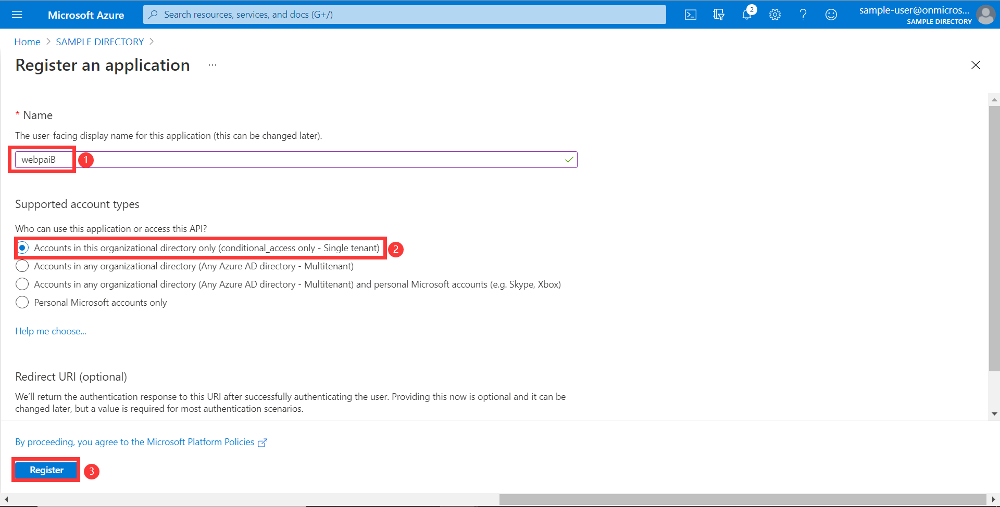

# Azure OAuth 2.0 Sample for Azure AD Spring Boot Starter Resource Server client library for Java

## Key concepts
This sample illustrates how to protect a Java web API by restricting access to its resources to authorized accounts only.

1. Obtain the access token from the HTTP request header.
2. Use `JwtDecoder` to parse the access token into `Jwt`.
3. Verify `aud`, `iss`, `nbf`, `exp` claims in access token.
4. Extract information from JWT in `AADOAuth2AuthenticatedPrincipal` object after a successful verification.
5. Save the `AADOAuth2AuthenticatedPrincipal` into SecurityContext.

### Protocol diagram


## Getting started
### Prerequisites
- [Environment checklist][environment_checklist]

### Configure Web API
1. In this section, you register your web API in App registrations in the Azure portal.
1. Search for and select your tenant in **Azure Active Directory**.
1. Under **Manage** In the same tenant, select **App registrations** -> **New registration**.
1. The registered application name is filled into `webapiB`(For better distinguish between [Resource Server] and [Resource Server Obo], this application is named **webapiB**), select **Accounts in this organizational directory only**, click the **register** button.
1. Under **webapiB** application, select **Certificates & secrets** -> **new client secret**, expires select **Never**, click the **add** button, remember to save the secrets here and use them later.
1. Under **webapiB** application, select **Expose an API** -> **Add a scope**, Use the default Application ID URI, click **Save and continue** button.
1. Wait the page refresh finished. Then set the **Scope name** to `WebApiB.ExampleScope`.
1. Finally, the api exposed in `webapiB`.

See [Expose scoped permission to web api] for more information about web api.

## Examples
### Configure application.yml
```yaml
#If we configure the azure.activedirectory.client-id or azure.activedirectory.app-id-uri will be to check the audience.
#In v2.0 tokens, this is always client id of the app, while in v1.0 tokens it can be the client id or the application id url used in the request.
#If you are using v1.0 tokens, configure both to properly complete the audience validation.

azure:
  activedirectory:
    client-id: <client-id>
    app-id-uri: <app-id-uri>
```

### Run with Maven
```shell
# Under sdk/spring project root directory
cd azure-spring-boot-samples/aad/azure-spring-boot-sample-active-directory-resource-server
mvn spring-boot:run
```

### Access the Web API
We could use Postman to simulate a Web APP to send a request to a Web API.

**NOTE**: 
1. You can use [resource server password credentials] to get access token.
1. The `aud` in access token should be the current Web API.

```http request
GET /file HTTP/1.1
Authorization: Bearer eyJ0eXAiO ... 0X2tnSQLEANnSPHY0gKcgw
```
```http request
GET /user HTTP/1.1
Authorization: Bearer eyJ0eXAiO ... 0X2tnSQLEANnSPHY0gKcgw
```

### Check the authentication and authorization
1. Access `http://localhost:<your-Configured-server-port>/file` link: success.
2. Access `http://localhost:<your-Configured-server-port>/user` link: fail with error message.

## Troubleshooting

## Next steps
## Contributing
<!-- LINKS -->
[environment_checklist]: https://github.com/Azure-Samples/blob/main/azure-spring-boot-samples/ENVIRONMENT_CHECKLIST.md#ready-to-run-checklist
[Expose scoped permission to web api]: https://docs.microsoft.com/azure/active-directory/develop/quickstart-configure-app-expose-web-apis
[Resource Server]: https://github.com/Azure-Samples/blob/main/azure-spring-boot-samples/aad/azure-spring-boot-sample-active-directory-resource-server
[Resource Server Obo]: https://github.com/Azure-Samples/blob/main/azure-spring-boot-samples/aad/azure-spring-boot-sample-active-directory-resource-server-obo
[resource server password credentials]: https://docs.microsoft.com/azure/active-directory/develop/v2-oauth-ropc
